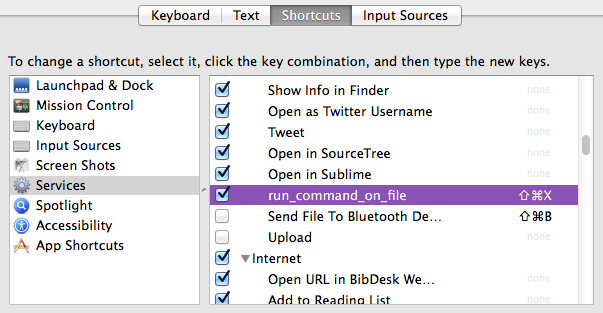

#Run Shell Command Finder Service
##By Stewart Bracken
===
####Mac Finder service to quickly run a shell command on selected Finder items

###Installation:
1. Place 'run_command_on_files.workflow' into ~/Libary/Services

###Tips:
* I highly recommend giving this service a keyboard shortcut. You can do this by going to System Preferences > Keyboard > Shortcuts > Services (left box), and finding the run_command_on_file item. Assign your favorite shortcut to this!

###Usage:
1. Highlight items in Finder.
2. Activate the service. Use your shortcut, or control click the selection, navtgate to Services, and select run_command_on_file.
3. Type in a command. Place an '@' wherever you want the full absolute path to the item to be in your shell command. Or omit the '@' and the service will place the path at the end of your entry.

======

#####Issues:
* I haven't tested this extensively because I just made it, let me know if you find any bugs.

#####Bugs:
* rm doesn't work.
